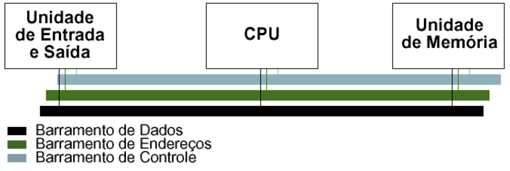
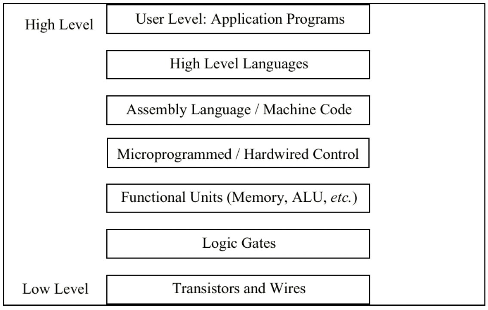

# Introdução à Arquitetura de Computadores

## O que significa?

- O termo **arquitetura** é utilizado, principalmente, na construção civil e na decoração de edificações;
- O termo **arquitetura** diz respeito à forma e a estrutura de uma construção civil, e refere-se à arte ou a técnica de projetar e edificar o ambiente habitado pelo ser
humano.
- A arquitetura é um conjunto de elementos que compõem um ambiente, como um edifício, um complexo ou um complexo urbano.

## O que significa arquitetura em computação?

- Na área da Computação o termo foi adaptado para denominar a técnica de projetar e construir computadores.
- A Arquitetura de Computadores é, basicamente, o projeto conceitual e fundamental da estrutura operacional de um sistema computacional.
- A Arquitetura de Computadores é a representação de um sistema computacional na forma de um conjunto de elementos que compõem um ambiente, como um edifício, um complexo ou um complexo urbano.
- Requisitos necessários para que um computador funcione, e de como organizar os diversos componentes para obter os melhores resultados.
    - (ex. tamanho de um tipo de dados – 32 bits para um inteiro).
- A Organização de Computadores trata da estrutura interna que não é visível para o programador 
    - (ex. freqüência do relógio ou tamanho da memória física).
- Há um conceito de níveis na arquitetura de computadores. A idéia básica é que existem muitos níveis nos quais o computador pode ser considerado, do nível mais alto, onde o usuário executa programas, ao nível mais baixo, que consiste de transistores e fios.

## O que se entende como computador?

- Como computador entendemos qualquer tipo de dispositivo capaz de **receber uma entrada** e que **retorna uma saída** _após_ **realizar uma série de operações** com base nos valores recebidos e armazenados. 

Há vários tipos de computadores, de acordo com a sua finalidade. Uma das formas de classificá-los é por meio das seguintes categorias:

1. Desktops ou Notebooks
2. Servidores
3. Sistemas Embarcados
4. Smartphones
5. Tablets 

## Por que é importante estudar Arquitetura de Computadores?

- Saber como um computador funciona;
- Entender a sua capacidade de processamento;
- Saber como aplicar a Arquitetura de Computadores em um projeto;
- Identificar os requisitos necessários para que um computador funcione;
- Saber como organizar os diversos componentes para obter os melhores resultados.
- Identificar os limites da arquitetura estudada;
- Dimensionar o projeto de acordo com os requisitos, de forma a melhorar o desempenho e segurança no uso do computador;

## Máquina de Cálculo de Pascal

- Executa operações aritméticas básicas (1a metade do século XVII). Não contém o que se consideram as partes básicas de um computador.
- Apenas no século XIX Babbage reuniu os conceitos de controle mecânico e cálculo mecânico numa máquina que possui as partes básicas de um computador digital.

{width=70%} 
*Fig. 1 - Máquina de Cálculo de Pascal*

## A Máquina de Turing

A Máquina de Turing é um dispositivo teórico conhecido como máquina universal, que foi concebido pelo matemático britânico Alan Turing (1912-1954), muitos anos antes de existirem os modernos computadores digitais (o artigo de referência foi publicado em 1936). Num sentido preciso, é um modelo abstrato de um computador, que se restringe apenas aos aspectos lógicos do seu funcionamento (memória, estados e transições), e não a sua implementação física. Numa máquina de Turing pode-se modelar qualquer computador digital.

<iframe width="560" height="315" src="https://www.youtube.com/embed/0lLCD6mx9W4" title="YouTube video player" frameborder="0" allow="accelerometer; autoplay; clipboard-write; encrypted-media; gyroscope; picture-in-picture" allowfullscreen></iframe>

## O Modelo de von Neumann

O modelo de von Neumann possui cinco componentes principais:

1. unidade de entrada; 
2. unidade de saída; 
3. unidade lógica
aritmética; 
4. unidade de memória; 
5. unidade de controle.

{width=30%} 
*Fig. 2 - Arquitetura de von Neumann*

<iframe width="560" height="315" src="https://www.youtube.com/embed/tZ5W2LpdcEw" title="YouTube video player" frameborder="0" allow="accelerometer; autoplay; clipboard-write; encrypted-media; gyroscope; picture-in-picture" allowfullscreen></iframe>

### Uma breve (e muito boa) história do Computador de Turing e von Neumann

No vídeo, a seguir, pode-se ver um belíssimo levantamento histórico sobre o computador de Turing e um computador de von Neumann, contada por Fabio Akita.

<iframe width="560" height="315" src="https://www.youtube.com/embed/G4MvFT8TGII" title="YouTube video player" frameborder="0" allow="accelerometer; autoplay; clipboard-write; encrypted-media; gyroscope; picture-in-picture" allowfullscreen></iframe>

## O Modelo Barramento de Sistema

- Refinamento do modelo de von Neumann, O modelo de barramento de sistema possui uma CPU (ALU e controle), e memória e uma unidade de entrada/saída (I/O).
- A comunicação entre os componentes é realizada através de um caminho compartilhado chamado barramento de sistema (bus), constituído do barramento de dados, do barramento de endereços e do barramento de controle. Existe também um barramento de energia e algumas arquiteturas podem ter um barramento de I/O separado.

{width=50%} 
*Fig. 3 - Modelo Barramento de Sistema*

## Níveis de Máquinas

- Existe um certo número de níveis em um computador (o número exato é discutível), do nível do usuário descendo ao nível do
transistor.
- Descendo a partir do nível mais alto, os níveis se tornam menos abstratos e mais da estrutura interna do computador se torna visível.

{width=60%} 

## O Modelo Little Man Computer (LMC)

- O LMC é um modelo didático de um computador, criado por Stuart Madnick, em 1965.
- Dedicado ao ensino, modela um computador simples baseado na arquitetura de von Neumann, com todas as características dos computadores modernos.
- O modelo LMC é baseado no conceito de um homenzinho trancado em uma sala pequena.

<iframe width="560" height="315" src="https://www.youtube.com/embed/VT3nx3fCZVg" title="YouTube video player" frameborder="0" allow="accelerometer; autoplay; clipboard-write; encrypted-media; gyroscope; picture-in-picture" allowfullscreen></iframe>