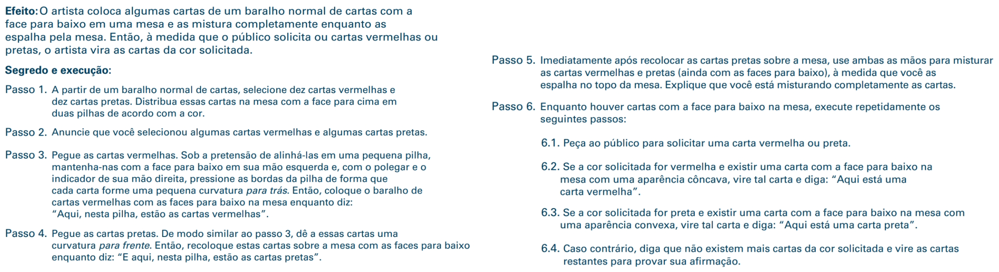
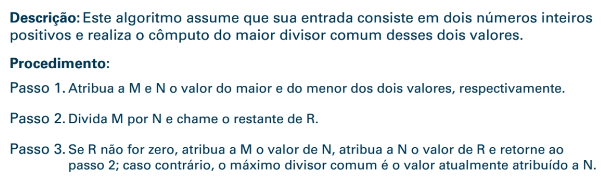
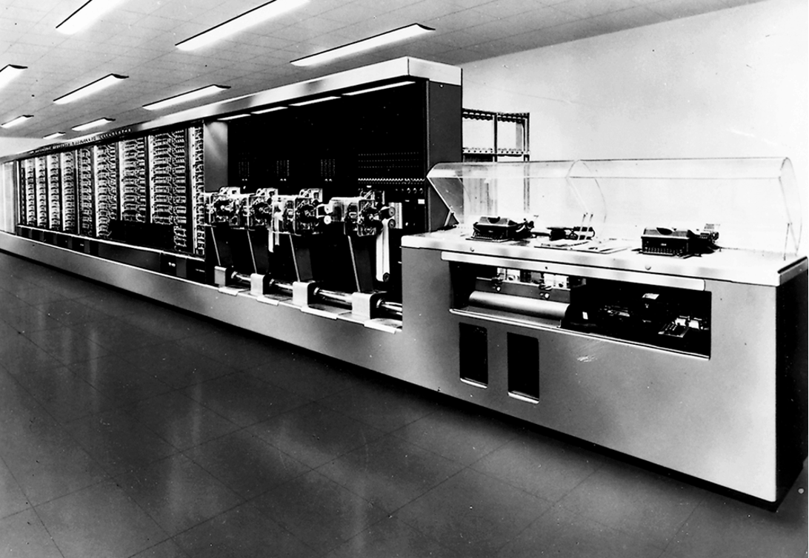
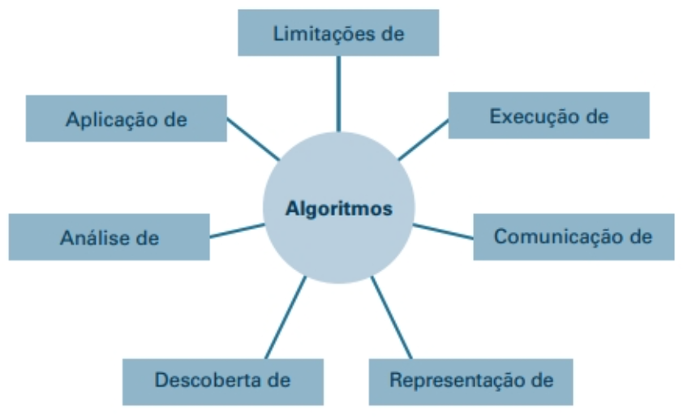
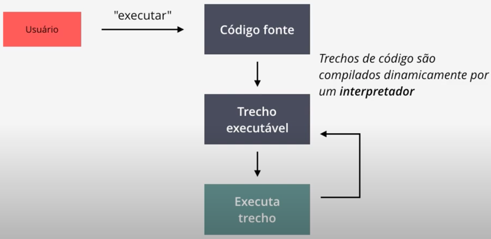
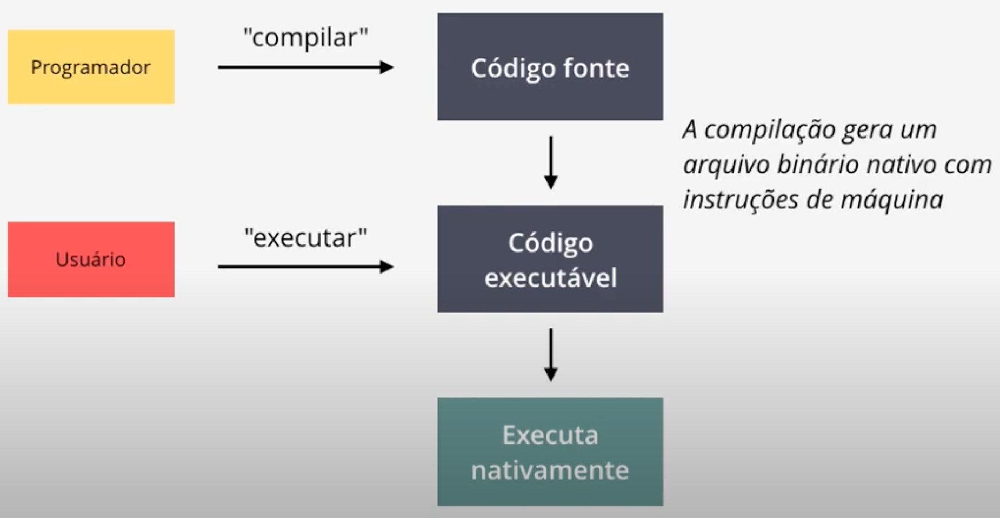
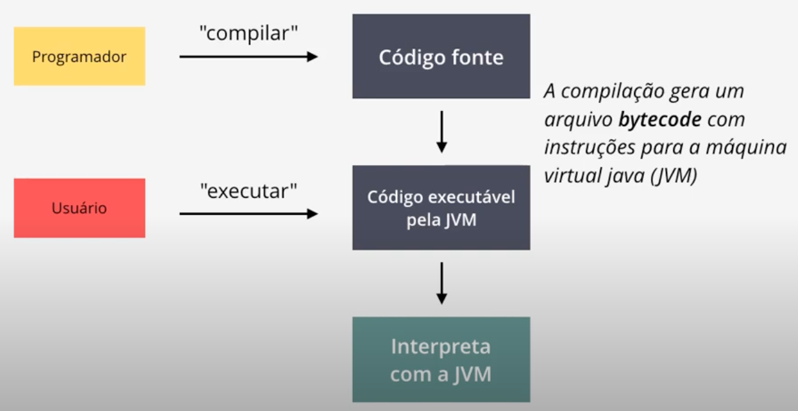

# O que é '**Ciência da Computação**'?

## CCMP3056 Introdução à Computação C

Vamos conversar um pouco do que é Ciência da Computação e quais são os objetivos do curso.

## Capítulo 0: Introdução

- 0.1 O papel dos algoritmos
- 0.2 As origens das máquinas de computação
- 0.3 A Ciência dos Algoritmos
- 0.4 Abstração
- 0.5 Um esboço do nosso estudo (disponível no livro-texto)
- 0.6 Repercussões Sociais

## Terminologia

- **Algoritmo**: um conjunto de etapas que define como uma tarefa é realizada
- **Programa**: uma representação de um algoritmo
- **Programação**: O processo de desenvolvimento de um programa
- **Software**: programas e algoritmos
- **Hardware**: Equipamento

## Figura 0.1 Um algoritmo para um truque de mágica

{width=70%}

## História dos Algoritmos

- O estudo de algoritmos era originalmente um assunto da matemática.
- Exemplos iniciais de algoritmos
- Algoritmo de divisão longa
- Algoritmo Euclidiano
- **Teorema da Incompletude de Gödel**: Alguns problemas não podem ser resolvidos por algoritmos.

## Figura 0.2 O algoritmo Euclidiano

{width=70%}

## Origens das máquinas de computação

- Primeiros dispositivos de computação
    - Ábaco: as posições das contas representam os números
    - Máquinas baseadas em engrenagens (1600-1800)
        - As posições das engrenagens representam números
        - Blaise Pascal, Wilhelm Leibniz, Charles Babbage

## Figura 0.3 Um ábaco

{width=70%}

## Armazenamento de dados antecipado

- Cartões perfurados
    - Usado pela primeira vez em Jacquard Loom (1801) para armazenar padrões para tecidos de tecelagem
    - Armazenamento de programas no mecanismo analítico de Babbage
    - Popular na década de 1970
- Máquinas guiadas por engrenagens

## Primeiros computadores

- Baseado em relés mecânicos
    - 1940: Stibitz nos Laboratórios Bell
    - 1944: Havard Mark I: Howard Aiken e IBM em Harvard
- Baseado em tubos de vácuo
    - 1937-1941: Atanasoff-Berry no estado de Iowa
    - Década de 1940: Colossus: decifrador secreto de códigos alemães
    - Década de 1940: ENIAC: Mauchly \& Eckert na Universidade da Pensilvânia.

## Figura 0.4 O computador Havard Mark I

{width=70%}

## Computadores pessoais

- Usado pela primeira vez por amadores
- A IBM lançou o PC em 1981.
    - Aceito pelas empresas
    - Tornou-se o design de hardware padrão para a maioria dos computadores desktop
    - A maioria dos PCs usa software da Microsoft

## Into the Millennia

- A Internet revolucionou as comunicações
    - Rede mundial de computadores (World Wide Web)
    - Mecanismos de buscas (Google, Yahoo e Microsoft)
- Miniaturização de máquinas de computação
    - Embutido (GPS, em motores de automóveis)
    - Smartphone

## Ciência da Computação

- A ciência dos algoritmos
- Extrai de outros assuntos, incluindo
    - Matemática
    - Engenharia
    - Psicologia
    - Administração de Empresas
    - Ciências naturais
    - Arte (imagens, músicas)
    - Esporte

## Questões Centrais da Ciência da Computação

- Quais problemas podem ser resolvidos por processos algorítmicos?
- Como a descoberta de algoritmos pode ser facilitada?
- Como as técnicas de representação e comunicação de algoritmos podem ser aprimoradas?
- Como as características de diferentes algoritmos podem ser analisadas e comparadas?
- Como os algoritmos podem ser usados ​​para manipular informações?
- Como os algoritmos podem ser aplicados para produzir comportamento inteligente?
- Como a aplicação de algoritmos afeta a sociedade?

## Habilidades mais importantes

O cientista da Computação deve ser capaz de resolver problemas do mundo real, ou seja, apresentar uma estrutura lógico-matemática que possibilite a resolução de um problema, de forma computacional.

## Habilidades básicas

- Interesse particular por **matemática**;
- Formular um problema do mundo real em termos computacionais;
- Elaborar uma solução para o problema, em termos computacionais:
    - Algoritmo;
-Escrever um programa, através de uma linguagem de programação;
- Testar o programa, a fim de verificar se este apresenta uma solução esperada e de forma correta.

## Habilidades avançadas

- Gerenciar software (pequeno, médio e grande porte);
- Construir software para lidar com grandes quantidades de dados
    - Big Data, Mineração, Aprendizagem de Máquina...
- Fazer parte de equipes de trabalho; e, em alguns momentos você deverá ser capaz de gerenciar essas equipes de trabalho;
- Comunicar-se com clientes e usuários para entender e resolver os problemas, dificuldades e necessidades apresentadas.

## Habilidades de solucionar problemas

- Habilidades de solucionar problemas
    - Formular questões;
    - Pensar criativamente para resolver os problemas;
    - Expressar a solução de forma simples, clara e precisa.

- O estudante deve aprender a programar, preferencialmente e várias linguagens.

## Figura 0.5 O papel central dos algoritmos na ciência da computação

{width=70%}

## Abstração

- **Abstração**: a distinção entre as propriedades externas de uma entidade e os detalhes da composição interna da entidade
- **Ferramenta abstrata**: um ``componente'' que pode ser usado sem se preocupar com as propriedades internas do componente

## Algoritmo

Uma lista de instruções para resolver um problema;

- Analisar o problema;
- Pesquisar sobre o problema;
- Criar um algoritmo genérico que resolva o problema;
- Escrever (através de uma linguagem de programação) um programa que resolva o problema;
- Testar o programa escrito para validar a solução, de forma precisa.

## Linguagens de Progamação

- Linguagens formais, precisas, cujas instruções podem ser executadas por um computador.
    - Linguagem de programação de baixo nível:
        - Linguagem de máquina;
        - Assembly (linguagem de montagem);
    - Linguagem de alto nível:
        - Python;
        - Java;
        - C/C++;
        - JavaScript;
        - Ruby;
        - ...

## Linguagens interpretadas

{width=70%}

## Linguagens compiladas

{width=70%}

## Linguagens híbridas (interpretadas e compiladas)

Temos algumas linguagens de programação mais modernas, por exemplo, Java e Python.

{width=70%}

## Repercussões Sociais

- Os avanços na ciência da computação levantam novas questões.
    - Na legislação: questões de direitos e responsabilidades
    - No governo: questões de regulamentação
    - No local de trabalho: questões sobre profissionalismo
    - Na sociedade: questões sobre comportamento social

## Teorias Éticas

- Baseado em consequências:
    - O que leva ao maior benefício?
- Com base no dever:
    - Quais são minhas obrigações intrínsecas?
- Com base em contrato:
    - Que contratos devo honrar?
- Baseado em personagem:
    - Quem eu quero ser?

## Por onde começar?

Uma boa forma de iniciar o aprendizado em Computação:

- aprender a escrever códigos simples em uma linguagem de alto nível (Python);
- executar pequenos programas (ou scripts);
- aprender novos conceitos incrementalmente;
- aumentar a sofisticação e o tamanho dos programas progressivamente.
