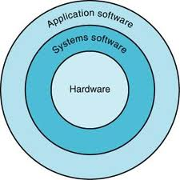
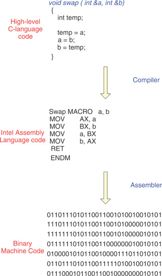
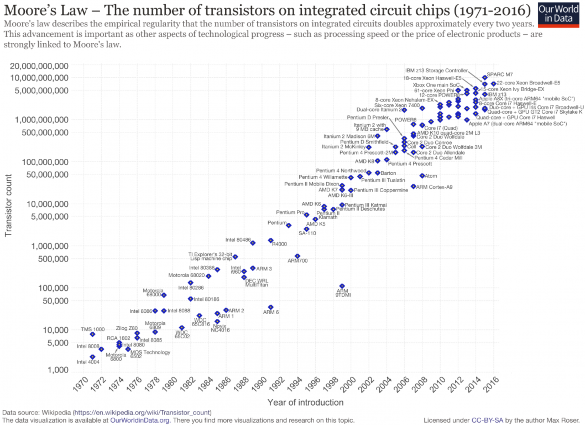

# Tecnologias e aplicações de computadores

## Tecnologias computacionais

### O que são tecnologias computacionais?

Em poucas palavras, um sistema computacional é um conjunto de dispositivos eletrônicos que utilizamos para todo um processamento de alguma informação, ou seja, união de hardware (parte física) e software (parte lógica).

- A sociedade como elemento de constante transformação (como, e por quê?)
- A sociedade da informação, como é chamada por inúmeros autores, que se fundamenta na **Informação**, e a depender da granularidade e nível dessa informação, **dados**, ou seja, na menor unidada da informação, como um bem, impulsiona:
  - Desenvolvimento social e econômico;
  - Criação de conhecimento;
  - Produção de riquezas e novas oportunidades;
  - Contribui para o bem-estar e qualidade de vida das pessoas\ldots

É importante destacar que temos um processo que é (ou tende a ser) "**eficaz**" e "**eficiente**", envolvendo a computação e problemas (ou necessidades) do ser humano.
Os mecanismos que tratam dados e informações estão se tornando `inteligentes' o suficiente para que o tempo de resposta seja muito mais rápido e eficiente.

## Computação e Sociedade

### Quais são os impactos da computação na sociedade?

- Necessidades da sociedade
- Internet
- Supercomputação
    - Previsão meteorológica
    - Simulações
- Forma de negócios e interações sociais
- Realidade virtual e aumentada
- Computação pervasiva e ubíqua

## Classes de Computadores

- Desktops e notebooks
    - Propósito geral; custo/benefício;
    - Desempenho;
- Servidores
    - Comunicação;
    - Escalabilidade; e,
    - Disponibilidade
- Embarcados
    - Restrições de desempenho;
    - Custo/capacidade de processamento

## Desempenho de um programa

- Leva-se em consideração:
  - Algoritmo utilizado;
  - A linguagem de programação:
    - compilada vs. interpretada vs. híbrida;
  - Arquitetura e geração do dispositivo:
    - O número de instruções que podem ser executas por ciclo de clock;
    - Interrupções e Memória;
    - Sistemas de I/O; Armazenamento.
  Sistema Operacional.

## Desempenho de um programa

- O algoritmo (escopo de outras disciplinas):
  - Diretamente relacionado ao número de instruções do código-fonte ao número de operações/interrupções de entrada e saída.

Afetado por:

- Linguagem de programação;
- Compiladores;
- Arquiteturas.

Estes determinam o número de instruções de máquina para cada instrução em nível computacional.

## Desempenho de um programa

Afetado por:

- Sistemas de I/O (Hardware e Sistema Operacional);
- Determinam a velocidade em que as operações podem ser ser executadas;

## Quando pensamos em desenvolver uma aplicação

- O que está envolvido:
  - Precisamos ter em mente que vamos nos utilizar de vários conceitos, e interferir com várias camadas computacionais:
    - Aplicação de Software;
    - Sistemas de Software;
    - Hardware

<figcaption>Copyright © 2009 Elsevier, Inc. All rights reserved.</figcaption>

## Visão simplificada: *Software* ou Aplicação (Apps)

- Camada de abstração mais externa;
- Desenvolvido em liguagem de programação de alto nível;
- A depender do paradigma, pode conter várias camadas;

## Visão simplificada: Sistema de *Software*

- Compilador: responsável por traduzir o código desenvolvido (alto nível) para a linguagem *Assembly*;
- Montador: responsável por traduzir instruções simbólicas para binário (instruções de máquina).
- Sistema Operacional: é responsável pela supervisão e controle dos recursos de um computador ao executar programas (instruções de vídeo, alocação de memória, impressão, pendrives\ldots).

{height=70%}

<figcaption>O processo de compilação/montagem de uma instrução de alto nível em linguagem de máquina.</figcaption>

## Abstrações

- As **abstrações** ajudam a tratar a complexidade;
- Revelam detalhes quando necessário;
- Uma das abstrações mais importantes é a interface entre o *hardware* e o *software* de nível mais baixo:
  - Arquitetura do Conjunto de Instruções (ISA - Instruction Set Architecture);

## Abstrações - ISA

- ISA
  - Instruções, registradores, acesso à memória, recursos de I/O;
- Interface binária da aplicação;
  - Interface de Sistema de Software;
- Implementação;
  - Hardware que obedece a abstração de uma ISA.

## Evolução das Tecnologias

|  Ano | Tecnologia usada em Computadores           | Performance relativa/custo por unidade |
|:----:|--------------------------------------------|---------------------------------------:|
| 1951 | Tubos à vácuo                              |                                      1 |
| 1965 | Transistores                               |                                     35 |
| 1975 | Circuitos Integrados                       |                                    900 |
| 1995 | Circuitos Integrados em larga escala       |                              2.400.000 |
| 2005 | Circuitos Integrados em ultra larga escala |                          6.200.000.000 |

## Lei de Moore

{height=67%}

<figcaption>Gráfico mostra o aumento no número de transístores em processadores, de 1971 a 2016. (Fonte: Wikipedia).</figcaption>

## Referências

- White, S. A Brief History of Computing. Disponível em: [http://trillian.randomstuff.org.uk/~stephen/history/](http://trillian.randomstuff.org.uk/~stephen/history/). Acesso em: 9 ago. 2021.
- Computer Pioneers and Pioneer Computers (part 1): \url{https://youtu.be/qundvme1Tik}
- Computer Pioneers and Pioneer Computers (part 2): \url{https://youtu.be/wsirYCAocZk}
- Portal Educação. O que é um sistema computacional? Disponível em: https://siteantigo.portaleducacao.com.br/conteudo/artigos/informatica/o-que-e-um-sistema-computacional/46697. Acesso em: 25 set. 2021.
- UNIVESP. Vídeo Organização de Computadores - Aula 01 - Abstrações e tecnologias computacionais. Disponível em: https://youtu.be/HgA-oXOV7kI. Acesso em 10 Ago. 2019.